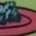
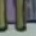

# Flintstones Character Detection

This repository presents an approach to detecting and classifying characters from *The Flintstones* animated series.

## Dataset

The dataset consists of screenshots extracted from episodes of *The Flintstones* and corresponding `.txt` files containing bounding box annotations for each face. Characters are labeled if they are main characters, otherwise, they are marked as unknown.
<p align="center">
  
  
  
</p>

<p align="center">
  
  
  
</p>
<p align="center">
  <b>First row: </b> Positive pictures (containing faces) <b>Second row: </b> Negative pictures
</p>


## Face Detection and Classification (AlexNet)

To detect faces, we trained an **AlexNet model** to distinguish between faces and non-faces. Positive samples were extracted using the provided bounding boxes, while negative samples were randomly selected patches from training images, avoiding overlap with faces.

For character classification, we trained separate **AlexNet models** for each main character (*Barney, Betty, Fred, Wilma*). Each model was trained to classify images detected as faces, treating the target character as the positive class and all others as negatives.

All face crops were resized, normalized, and converted to the required format for AlexNet. Training was done using **PyTorch**, with models initialized without pre-trained weights. The final layer was modified to output two classes (face vs. non-face, or character vs. others):

```python
model_alexnet = torch.hub.load('pytorch/vision:v0.10.0', 'alexnet', pretrained=False)
nr_filters = model_alexnet.classifier[4].out_features
model_alexnet.classifier[6] = nn.Linear(nr_filters, 2)  # Modified last layer
```

## Model Training

All models were trained similarly, using **CrossEntropyLoss** as the loss function and **SGD (Stochastic Gradient Descent)** as the optimizer with a learning rate of `0.001` and momentum of `0.9`. Each model was trained for **10 epochs** using mini-batches processed by a `data_loader`.

At each iteration, weights were updated using backpropagation and optimizer steps. The trained models were saved for inference.

## Sliding Window Detection

A **sliding window** approach (64x64 pixels) was used, with images resized at multiple scales to detect faces of varying sizes. Windows were extracted with a stride of **15 pixels** and normalized before being passed to the classifier.

- First, the **face detection model** classified windows as `face` or `non-face`. The **softmax function** was applied, and windows with a face probability > `0.99999` were considered detections.
- For detected faces, the **character classifiers** determined the most probable identity (`Barney`, `Betty`, `Fred`, `Wilma`). If no class had a probability > `0.5`, the face was labeled as `unknown`.
- **Non-Maximal Suppression (NMS)** was applied to eliminate redundant detections.

## Alternative Approach: Faster R-CNN

We also implemented **Faster R-CNN**, based on an existing PyTorch implementation, adapting it to our dataset by modifying the class labels:

```python
self.classes = ['_', 'barney', 'betty', 'fred', 'wilma', 'unknown']
```

A **pre-trained Faster R-CNN model** (on COCO) was fine-tuned for Flintstones character detection:

```python
def get_object_detection_model(num_classes):
    model = torchvision.models.detection.fasterrcnn_resnet50_fpn(pretrained=True)
    in_features = model.roi_heads.box_predictor.cls_score.in_features
    model.roi_heads.box_predictor = FastRCNNPredictor(in_features, num_classes)
    return model    
```

Training used **SGD** with a learning rate of `0.005`, momentum `0.9`, and weight decay `0.0005`. A **learning rate scheduler** adjusted the learning rate over **5 epochs**:

```python
num_epochs = 5
for epoch in range(num_epochs):
    train_one_epoch(model, optimizer, data_loader, device, epoch, print_freq=10)
    lr_scheduler.step()
    evaluate(model, data_loader_test, device=device)
```

After detection, **Non-Maximal Suppression (NMS)** was applied to filter overlapping detections:

```python
def apply_nms(orig_prediction, iou_thresh=0.3):
    keep = torchvision.ops.nms(orig_prediction['boxes'], orig_prediction['scores'], iou_thresh)
    final_prediction = orig_prediction
    final_prediction['boxes'] = final_prediction['boxes'][keep]
    final_prediction['scores'] = final_prediction['scores'][keep]
    final_prediction['labels'] = final_prediction['labels'][keep]
    return final_prediction
```

## Conclusion

Using convolutional neural networks (AlexNet and Faster R-CNN), this project successfully solves the problem of face detection and character classification in *The Flintstones* series. The sliding window approach combined with AlexNet provides a baseline method, while Faster R-CNN enhances performance through end-to-end object detection and classification.

